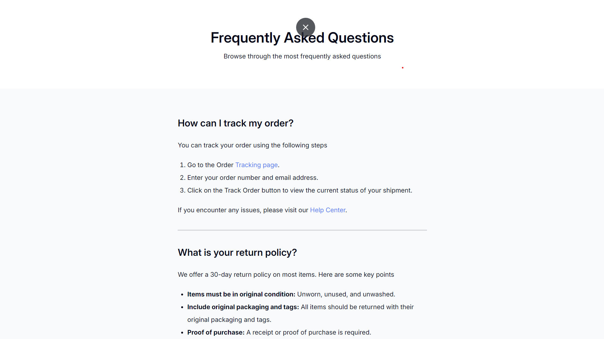

# Simple FAQ Page

Este proyecto es una página web sencilla de preguntas frecuentes (FAQ) que proporciona respuestas a preguntas comunes sobre el seguimiento de pedidos y la política de devoluciones.

## Vista Previa



Puedes ver la versión demo en vivo aquí: [Simple FAQ](https://ibrahim-003.github.io/Simple-FAQ/)

## Características

- **Responsiva**: La página está diseñada para adaptarse a diferentes tamaños de pantalla, mejorando la experiencia de usuario en dispositivos móviles y de escritorio.
- **Estilo minimalista**: Utiliza la fuente "Inter" para un diseño limpio y moderno.
- **Enlaces externos seguros**: Los enlaces a otras páginas usan atributos `target="_blank"` y `rel="noopener noreferrer"` para garantizar seguridad en la navegación.

## Estructura de Archivos

```
|-- index.html         # Página principal
|-- css/
    |-- reset.css      # Reseteo de estilos predeterminados del navegador
    |-- styles.css     # Estilos personalizados de la página
```

## Instalación

1. Clonar este repositorio en tu máquina local.
   ```bash
   git clone https://github.com/Ibrahim-003/Simple-FAQ.git
   ```
2. Asegúrate de que tienes conexión a Internet para cargar las fuentes de Google Fonts y los estilos CSS.
3. Abre `index.html` en tu navegador para ver la página.


## Uso

La página se puede personalizar fácilmente agregando más secciones de preguntas y respuestas en el HTML. Los estilos se pueden modificar desde el archivo `styles.css` para ajustar colores, fuentes, y otros elementos visuales.

## Tecnologías Utilizadas

- HTML5
- CSS3
- Google Fonts

## Autor

Este proyecto fue creado por [Ibrahim Almeyda].
